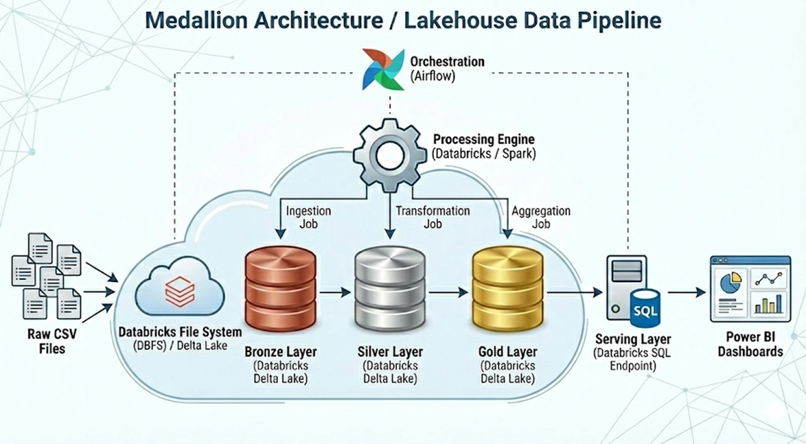
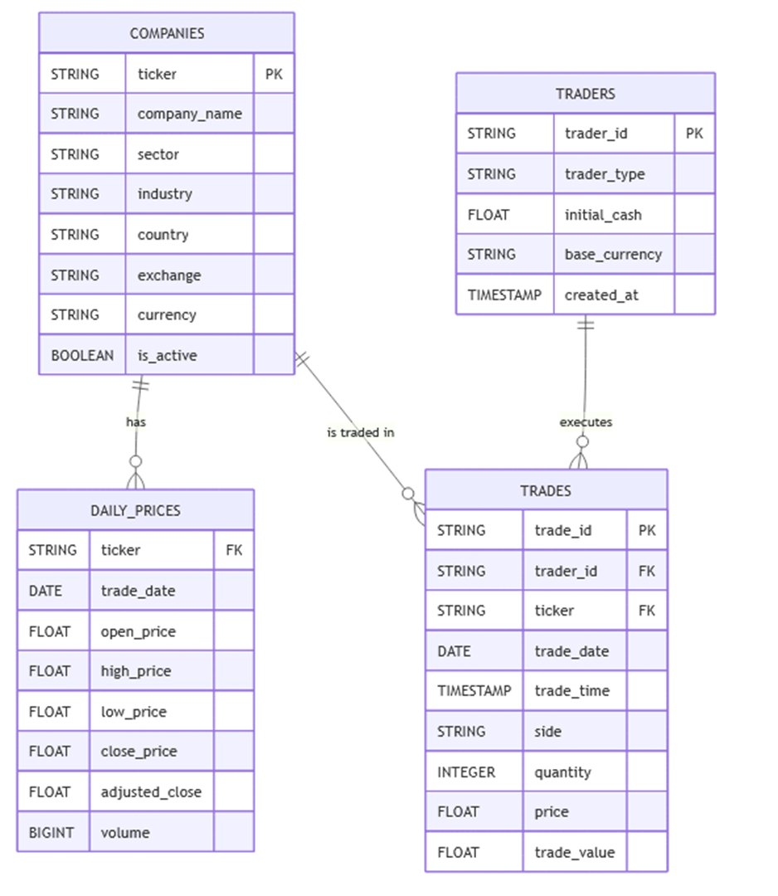

# 📊 Stock Trading & Investment Performance Analytics System

**End-to-End Data Analytics Capstone Project**

---

## 1. Executive Summary

The **Stock Trading & Investment Performance Analytics System** is an enterprise-grade, end-to-end analytics platform designed to process large-scale stock market and trading data, perform advanced financial analytics, and deliver actionable insights through interactive dashboards.

The system automates the ingestion, validation, transformation, and aggregation of financial datasets using a **Medallion Architecture (Bronze → Silver → Gold)** implemented on **Databricks** with **PySpark**, orchestrated via **Apache Airflow**, and visualized using **Power BI**.

This project simulates a real-world investment analytics environment used by trading firms and financial institutions.

---

## 2. Business Problem

Financial analysts and traders face multiple challenges:

- High volumes of raw, heterogeneous stock market data
    
- Manual and error-prone analysis workflows
    
- Lack of consolidated portfolio and market-level insights
    
- Difficulty measuring risk, volatility, and returns consistently
    

### Business Need

The organization requires a **centralized, automated analytics system** that:

- Processes historical and incremental stock data
    
- Tracks market trends and portfolio performance
    
- Calculates returns, volatility, and risk metrics
    
- Enables data-driven decision-making via dashboards
    

---

## 3. Project Objectives

The key objectives of this project are:

- Build a **scalable data pipeline** for stock trading analytics
    
- Automate ETL workflows with monitoring and error handling
    
- Perform **time-series, portfolio, and risk analytics**
    
- Deliver **Power BI dashboards** for business users
    
- Demonstrate **real-world data engineering and analytics practices**
    

---

## 4. System Architecture

### High-Level Architecture



### Architecture Principles

- **Medallion Architecture**
    
- Incremental processing using **watermarks**
    
- Data quality enforcement and quarantine
    
- Currency normalization using FX rates
    
- Optimized Delta tables for analytics
    

---

## 5. Technology Stack

### Data Processing & Analytics

- Python
    
- Pandas, NumPy
    
- PySpark (Databricks)
    

### Workflow Orchestration

- Apache Airflow
    

### Storage

- CSV (raw ingestion)
    
- Delta Lake (Bronze, Silver, Gold)
    

### Visualization

- Power BI
    

### DevOps & Collaboration

- Git & GitHub
    
- Databricks Notebooks
    
- Jupyter Notebooks
    

---

## 6. Data Model Overview

### Core Datasets

|Dataset|Description|
|---|---|
|Companies|Company master data (sector, industry, currency)|
|Daily Prices|OHLCV stock price data|
|Traders|Trader profile and base currency|
|Trades|Buy/Sell transactions|
|FX Rates|Currency conversion rates|


---

## 7. Data Engineering Implementation

---

## 7.1 Bronze Layer – Raw Data Ingestion

**Purpose:**  
Capture raw historical and incremental data with full traceability.

### Key Features

- Supports **incremental ingestion as part of the automated pipeline**.  
- Historical data was loaded once as an initial backfill and is not part of the scheduled pipeline.
    
- Adds metadata:
    
    - `ingestion_timestamp`
        
    - `source_file`
        
    - `load_type`
        
- Graceful handling of missing incremental files
    
- Delta Lake storage
    

### Implemented Files

- `historical_data_ingestion.py`
    
- `bronze.py`
    

### Example Bronze Tables

- `bronze_companies`
    
- `bronze_daily_prices`
    
- `bronze_traders`
    
- `bronze_trades`
    
- `bronze_fx_rates`
    

---

## 7.2 Silver Layer – Data Cleaning & Validation

**Purpose:**  
Create trusted, analytics-ready datasets.

### Key Processing Steps

#### 1. Incremental Processing

- Watermark-based ingestion using `silver_watermark` table
    
- Processes only new records since last run
    

#### 2. Data Quality Validation

- Null checks across all columns
    
- Negative value validation (price, quantity, volume)
    
- Type casting (date, timestamp, numeric)
    
- Foreign key validation
    

#### 3. Reject Handling

Invalid records are quarantined into:

- `silver_data_quality_rejects`
    
- `silver_fk_rejects`
    

Each rejected record stores:

- Table name
    
- Reject reason
    
- Full record JSON
    
- Timestamp
    

#### 4. Deduplication

- Window functions (`row_number`)
    
- Latest record retained based on ingestion timestamp
    

#### 5. Merge Logic

- Idempotent `MERGE INTO` operations
    
- Supports updates and inserts
    

### Implemented File

- `silver.py`
    

---

## 7.3 Gold Layer – Business & Financial Analytics

**Purpose:**  
Provide curated, business-ready analytics tables.

### Currency Normalization

- All analytics standardized to **USD**
    
- FX conversion handled in Silver Views
    

---

### Gold Tables Implemented

#### 1. Market-Level KPIs

`gold_market_daily_kpis_usd`

**Metrics**

- Total traded volume
    
- Average closing price
    
- Market daily return
    
- 30-day volatility
    
- Active companies count
    

---

#### 2. Company Performance

`gold_company_performance_usd`

**Metrics**

- Daily returns
    
- 20 & 50-day moving averages
    
- Rolling volatility
    
- Volume trends
    
- Sector & industry context
    

---

#### 3. Trader Portfolio Performance

`gold_trader_portfolio_performance_usd`

**Metrics**

- Buy vs Sell value
    
- Daily PnL
    
- Cumulative PnL
    
- Trade frequency
    

---

#### 4. Sector Performance

`gold_sector_performance_usd`

**Metrics**

- Sector-wise returns
    
- Volatility
    
- Volume comparison
    

---

#### 5. Monthly Market Trends

`gold_monthly_market_trends`

**Metrics**

- Monthly returns
    
- Rolling 3-month averages
    
- Long-term market direction
    

### Implemented File

- `gold_002.py`
    

---

## 8. Workflow Orchestration (Airflow)

### DAG Responsibilities

- Schedule daily ingestion and transformations
    
- Enforce task dependencies:
    
    - Bronze → Silver → Gold
        
- Handle retries and failures
    
- Log execution status
    

### Benefits

- Fully automated pipeline
    
- Production-grade orchestration
    
- Re-runnable and fault-tolerant workflows
    

---

## 9. Visualization & Reporting (Power BI)

### Dashboards Delivered

#### 1. Market Overview Dashboard

- Market trend lines
    
- Daily returns
    
- Volatility indicators
    
- Active stocks count
    

#### 2. Company Performance Dashboard

- Price trends
    
- Moving averages
    
- Sector comparison
    

#### 3. Trader Portfolio Dashboard

- PnL trends
    
- Buy vs Sell analysis
    
- Trader-level performance
    

#### 4. Sector Analysis Dashboard

- Sector growth
    
- Risk comparison
    
- Volume distribution
    

---

## 10. Testing & Validation

### Data Validation

- Row counts across layers
    
- Rejected vs accepted record checks
    
- FK consistency validation
    

### Analytics Validation

- Return and volatility formula verification
    
- PnL reconciliation
    
- Dashboard vs Gold table comparison
    

---

## 11. How to Run the Project


## **Step 1: Prepare Incremental Data**

Place new incremental CSV files in the expected folder structure:

```
/Volumes/capstone/default/raw_data/
 ├── companies/incremental/<run_date>/
 ├── daily_prices/incremental/<run_date>/
 ├── traders/incremental/<run_date>/
 ├── trades/incremental/<run_date>/
 ├── fx_rates/incremental/<run_date>/
```

> Each folder contains only **new data for that run date**.

---

## **Step 2: Trigger the Airflow DAG**

* Start Airflow services (scheduler and webserver)
* Trigger the DAG manually or allow it to run on schedule

This DAG controls the **entire pipeline execution**.

---

## **Step 3: Bronze Ingestion (Databricks Job)**

* Airflow triggers the **Bronze Databricks job**
* The job:

  * Reads incremental CSV files
  * Adds ingestion metadata (timestamp, source, load type)
  * Appends data to Bronze Delta tables
* If no data is found for a dataset, ingestion is skipped gracefully

---

## **Step 4: Silver Processing (Databricks Job)**

* After Bronze completes, Airflow triggers the **Silver Databricks job**
* The job:

  * Reads new Bronze records using watermarks
  * Validates data (nulls, negative values, data types)
  * Removes duplicates
  * Enforces foreign key integrity
  * Moves invalid records to reject tables
  * Merges clean data into Silver tables

---

## **Step 5: Gold Analytics (Databricks Job)**

* After Silver completes, Airflow triggers the **Gold Databricks job**
* The job:

  * Applies currency conversion
  * Calculates returns, volatility, and KPIs
  * Aggregates market, company, trader, and sector metrics
  * Writes results to Gold tables

---

## **Step 6: Verify Pipeline Completion**

After the DAG finishes:

* Bronze, Silver, and Gold tables are updated
* Reject tables capture invalid records (if any)
* Watermark tables are updated
* Analytics tables are ready for reporting

---

## **Step 7: Refresh Power BI Dashboards**

* Open Power BI
* Refresh the dataset connected to Gold tables
* Dashboards reflect the latest incremental data

---

## 12. Conclusion

The Stock Trading & Investment Performance Analytics System implements a robust, end-to-end analytics pipeline using a Medallion Architecture on Databricks, with incremental data ingestion orchestrated by Apache Airflow. The solution ensures data quality, scalability, and reliability through validation, deduplication, and audit-friendly processing.

The system delivers meaningful market, company, trader, and sector-level insights and presents them through Power BI dashboards to support data-driven investment decisions. Overall, the project reflects real-world enterprise data engineering practices and demonstrates a strong foundation in scalable analytics and workflow automation.